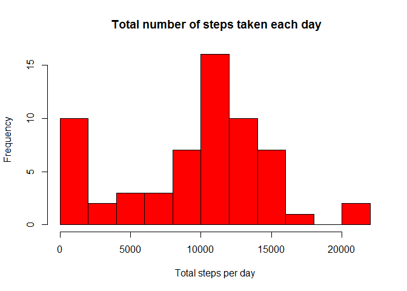
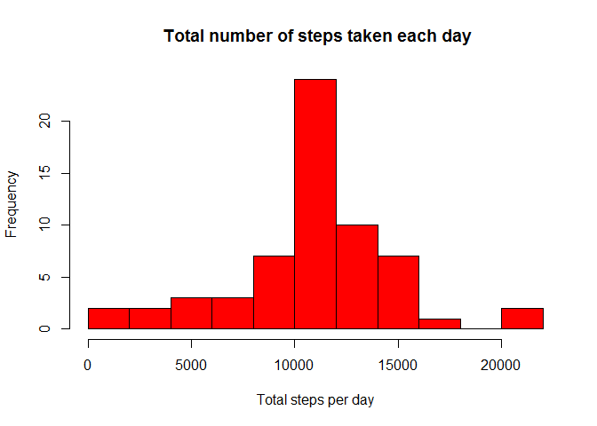

Reproducible Research: Peer Assessment 1
================
JLara
15 de abril de 2017

Introduction
------------

It is now possible to collect a large amount of data about personal movement using activity monitoring devices such as a Fitbit, Nike Fuelband, or Jawbone Up. These type of devices are part of the "quantified self" movement - a group of enthusiasts who take measurements about themselves regularly to improve their health, to find patterns in their behavior, or because they are tech geeks. But these data remain under-utilized both because the raw data are hard to obtain and there is a lack of statistical methods and software for processing and interpreting the data.

This assignment makes use of data from a personal activity monitoring device. This device collects data at 5 minute intervals through out the day. The data consists of two months of data from an anonymous individual collected during the months of October and November, 2012 and include the number of steps taken in 5 minute intervals each day.

The data for this assignment can be downloaded from the course web site:

Dataset: Activity monitoring data \[52K\] The variables included in this dataset are:

steps: Number of steps taking in a 5-minute interval (missing values are coded as NA) date: The date on which the measurement was taken in YYYY-MM-DD format interval: Identifier for the 5-minute interval in which measurement was taken The dataset is stored in a comma-separated-value (CSV) file and there are a total of 17,568 observations in this dataset.

Loading and preprocessing the data
==================================

-   Load the data

``` r
fileURL <- 'https://d396qusza40orc.cloudfront.net/repdata%2Fdata%2Factivity.zip'
dataFileZip <- "./repdata_Fdata_Factivity.zip"

# Download the file
if (file.exists(dataFileZip) == FALSE) {
  download.file(fileURL,destfile=dataFileZip ,method="curl")
  # Unzip the file
  unzip(zipfile=dataFileZip ,exdir=".")
}

activity <- read.csv("activity.csv")
```

-   Process/transform the data (if necessary) into a format suitable for your analysis

``` r
summary(activity)
```

    ##      steps                date          interval     
    ##  Min.   :  0.00   2012-10-01:  288   Min.   :   0.0  
    ##  1st Qu.:  0.00   2012-10-02:  288   1st Qu.: 588.8  
    ##  Median :  0.00   2012-10-03:  288   Median :1177.5  
    ##  Mean   : 37.38   2012-10-04:  288   Mean   :1177.5  
    ##  3rd Qu.: 12.00   2012-10-05:  288   3rd Qu.:1766.2  
    ##  Max.   :806.00   2012-10-06:  288   Max.   :2355.0  
    ##  NA's   :2304     (Other)   :15840

``` r
str(activity)
```

    ## 'data.frame':    17568 obs. of  3 variables:
    ##  $ steps   : int  NA NA NA NA NA NA NA NA NA NA ...
    ##  $ date    : Factor w/ 61 levels "2012-10-01","2012-10-02",..: 1 1 1 1 1 1 1 1 1 1 ...
    ##  $ interval: int  0 5 10 15 20 25 30 35 40 45 ...

We convert the "date" column of activity to the appropriate format

``` r
activity$date <- as.Date(activity$date, "%Y-%m-%d")
```

We look for in date the day of the week for later question

``` r
Sys.setlocale(category = "LC_ALL", locale = "english")
```

    ## [1] "LC_COLLATE=English_United States.1252;LC_CTYPE=English_United States.1252;LC_MONETARY=English_United States.1252;LC_NUMERIC=C;LC_TIME=English_United States.1252"

``` r
activity <- data.frame(date=activity$date, 
                           day=tolower(weekdays(activity$date)), 
                           steps=activity$steps, 
                           interval=activity$interval)

activity <- cbind(activity, 
                      weekday=ifelse(activity$day == "saturday" | 
                                     activity$day == "sunday", "weekend", 
                                     "weekday"))

activity <- data.frame(date=activity$date, 
                       day=activity$day, 
                       weekday=activity$weekday, 
                       interval=activity$interval,
                       steps=activity$steps)
head(activity)
```

    ##         date    day weekday interval steps
    ## 1 2012-10-01 monday weekday        0    NA
    ## 2 2012-10-01 monday weekday        5    NA
    ## 3 2012-10-01 monday weekday       10    NA
    ## 4 2012-10-01 monday weekday       15    NA
    ## 5 2012-10-01 monday weekday       20    NA
    ## 6 2012-10-01 monday weekday       25    NA

What is mean total number of steps taken per day?
-------------------------------------------------

For this part of the assignment, you can ignore the missing values in the dataset.

1.Calculate the total number of steps taken per day

``` r
steps_dates <- tapply(activity$steps, activity$date, sum,na.rm=TRUE)
```

2.Make a histogram of the total number of steps taken each day

``` r
hist(steps_dates, xlab = 'Total steps per day', main = ' Total number of steps taken each day', col = 'red', breaks=10)
```



3.Calculate and report the mean and median of the total number of steps taken per day

``` r
mean(steps_dates)
```

    ## [1] 9354.23

``` r
median(steps_dates)
```

    ## [1] 10395

What is the average daily activity pattern?
-------------------------------------------

1.Make a time series plot (i.e. type = "l") of the 5-minute interval (x-axis) and the average number of steps taken, averaged across all days (y-axis)

``` r
steps_interval <- tapply(activity$steps, activity$interval, mean,na.rm=TRUE)

plot(steps_interval ~ unique(activity$interval), type="l", xlab = "5-min interval",ylab="averaged across all days",main="average daily activity pattern")
```


2.Which 5-minute interval, on average across all the days in the dataset, contains the maximum number of steps?

``` r
steps_interval[which.max(steps_interval)]
```

    ##      835 
    ## 206.1698

Imputing missing values
-----------------------

1.Calculate and report the total number of missing values in the dataset (i.e. the total number of rows with NAs)

``` r
sum(is.na(activity$steps))
```

    ## [1] 2304

2.Devise a strategy for filling in all of the missing values in the dataset. The strategy does not need to be sophisticated. For example, you could use the mean/median for that day, or the mean for that 5-minute interval, etc.

-   The NA values are replaced by the mean of 5 minutes interval

``` r
Sys.setlocale(category = "LC_ALL", locale = "english")
```

    ## [1] "LC_COLLATE=English_United States.1252;LC_CTYPE=English_United States.1252;LC_MONETARY=English_United States.1252;LC_NUMERIC=C;LC_TIME=English_United States.1252"

``` r
new_activity <- activity

for (i in 1:nrow(activity)){
  if(is.na(activity$steps[i])){
    new_activity$steps[i]<- steps_interval[[as.character(activity[i, "interval"])]]
  }
}
```

3.Create a new dataset that is equal to the original dataset but with the missing data filled in.

``` r
head(new_activity) 
```

    ##         date    day weekday interval     steps
    ## 1 2012-10-01 monday weekday        0 1.7169811
    ## 2 2012-10-01 monday weekday        5 0.3396226
    ## 3 2012-10-01 monday weekday       10 0.1320755
    ## 4 2012-10-01 monday weekday       15 0.1509434
    ## 5 2012-10-01 monday weekday       20 0.0754717
    ## 6 2012-10-01 monday weekday       25 2.0943396

4.Make a histogram of the total number of steps taken each day and Calculate and report the mean and median total number of steps taken per day. Do these values differ from the estimates from the first part of the assignment? What is the impact of imputing missing data on the estimates of the total daily number of steps?

``` r
steps_dates_new <- tapply(new_activity$steps, new_activity$date, sum,na.rm=TRUE)
```

``` r
hist(steps_dates_new, xlab = 'Total steps per day', main = ' Total number of steps taken each day', col = 'red', breaks=10)
```



mean with NA estimated

``` r
mean(steps_dates_new)
```

    ## [1] 10766.19

median with NA estimated

``` r
median(steps_dates_new)
```

    ## [1] 10766.19

Are there differences in activity patterns between weekdays and weekends?
-------------------------------------------------------------------------

1.Create a new factor variable in the dataset with two levels - "weekday" and "weekend" indicating whether a given date is a weekday or weekend day.

``` r
head(new_activity)
```

    ##         date    day weekday interval     steps
    ## 1 2012-10-01 monday weekday        0 1.7169811
    ## 2 2012-10-01 monday weekday        5 0.3396226
    ## 3 2012-10-01 monday weekday       10 0.1320755
    ## 4 2012-10-01 monday weekday       15 0.1509434
    ## 5 2012-10-01 monday weekday       20 0.0754717
    ## 6 2012-10-01 monday weekday       25 2.0943396

2.Make a panel plot containing a time series plot (i.e. type = "l") of the 5-minute interval (x-axis) and the average number of steps taken, averaged across all weekday days or weekend days (y-axis). See the README file in the GitHub repository to see an example of what this plot should look like using simulated data.

``` r
library(lattice)
Sys.setlocale(category = "LC_ALL", locale = "english")
```

    ## [1] "LC_COLLATE=English_United States.1252;LC_CTYPE=English_United States.1252;LC_MONETARY=English_United States.1252;LC_NUMERIC=C;LC_TIME=English_United States.1252"

``` r
avg_data <-  aggregate(new_activity$steps, 
                       by=list(new_activity$weekday, 
                               new_activity$day, new_activity$interval), mean)

names(avg_data) <- c("day", "weekday", "interval", "mean")  

xyplot(mean ~ interval | day, avg_data, 
       type="l", 
       lwd=1, 
       xlab="5-minute interval", 
       ylab="Number of steps",
       layout=c(1,2))
```


